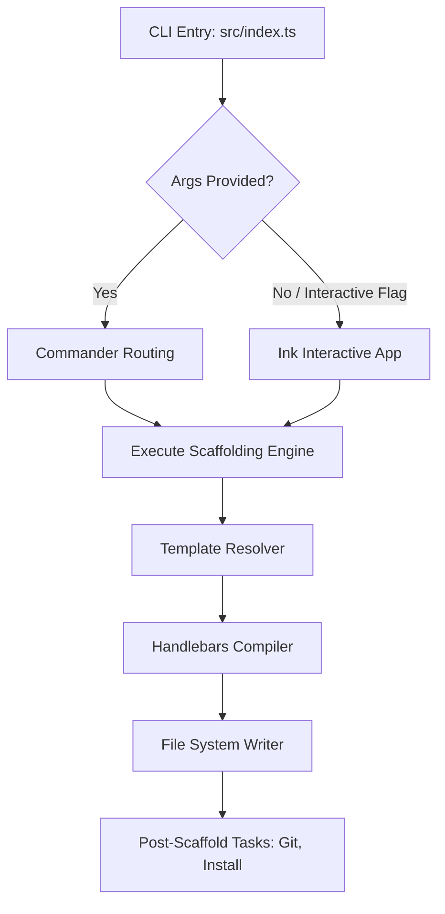

# CLI Scaffolding Tool Design Document (`scl-cli`)

This document outlines the design and architecture for `scl-cli`, a high-performance, developer-friendly command-line interface (CLI) for project generation and scaffolding. It features both a standard flag-based argument parser and an interactive React-based terminal user interface (TUI).

---

## 1. Vision & Architecture

The CLI is designed to be fast, extensible, and visually stunning. It is built on top of the Bun runtime and leverages the following core technologies:
* **Argument Parsing & CLI Flags**: [Commander.js](https://github.com/tj/commander.js/) (`@commander-js/extra-typings` and `commander`) for standard non-interactive inputs.
* **Interactive Terminal UI**: [Ink](https://github.com/vadimdemedes/ink) (React-based CLI rendering engine) to construct a premium, fluid console interface.
* **Templating Engine**: [Handlebars](https://handlebarsjs.com/) for generating files with variable interpolation.
* **Data Validation**: [Zod](https://github.com/colinhacks/zod) for validating user inputs and template configuration files.

### High-Level Architecture Diagram



---

## 2. CLI Command Specification

The CLI will support both direct command execution (flags/arguments) and interactive modes.

### Global Options
* `-v, --version`: Output the current version.
* `-h, --help`: Display help information.

### Commands

#### 1. `create [type] [project-name]`
Generates a new project scaffold for the specified type (e.g., `ms` for a microservice).

* **Arguments**:
  * `type` (optional): The type/alias of the project scaffold to create (e.g., `ms`, `microservice`). If omitted, the CLI enters interactive mode and prompts the user to select from the available project types.
  * `project-name` (optional): Name of the project directory. If omitted, the CLI will prompt the user (in interactive mode) or default to `my-[type]-project`.
* **Options**:
  * `-d, --description <desc>`: Project description.
  * `-a, --author <name>`: Author name.
  * `-g, --git`: Initialize a Git repository (default: true).
  * `--no-git`: Disable Git initialization.
  * `-i, --install`: Install dependencies automatically (default: true).
  * `--no-install`: Skip dependency installation.
  * `-y, --yes`: Skip interactive prompts (requires `type` to be provided; uses defaults for name and options).
  * `--interactive`: Force interactive mode even if arguments are provided.

#### 2. `list`
Lists all available scaffolding templates and project types.

---

## 3. Interactive Terminal UI Design (Ink)

If `scl-cli` is run without arguments, or with the `--interactive` flag, it enters a React-based interactive terminal app using **Ink**.

### Design Guidelines (Aesthetics)
To make the TUI look **ultra-premium**:
* **Color Palette**: Use smooth, modern ANSI/256-color palettes:
  * Primary Accent: Violet/Indigo (`#8b5cf6` or Magenta)
  * Success: Emerald Green (`#10b981`)
  * Info/Accent: Cyan (`#06b6d4`)
  * Text/Muted: Dim Gray or Cool Gray
* **Layout**: Clean margins, bullet symbols (`›`, `✔`, `✖`), and visual separation.
* **Transitions**: Smooth state rendering for inputs and lists.
* **Spinner**: High-framerate spinner (`ink-spinner`) during scaffolding and dependency installation.

### User Flow Screens

1. **Welcome Header**: A stylish ASCII logo or styled header with CLI metadata.
2. **Step 1: Project Type Selection** (skipped if `type` was passed as a CLI argument):
   * Interactive list where the user moves up/down with arrow keys (`↑`, `↓`) and presses `Enter` to select (e.g., `ms` for Microservice).
   * Dynamic description displayed below the selected type.
3. **Step 2: Project Name**:
   * Direct text input with character-by-character updates.
   * Auto-validates: ensures the directory doesn't already exist.
   * Defaults to a type-specific default like `my-[type]-project`.
4. **Step 3: Project Configuration**:
   * Text inputs for Description and Author (pre-filled with defaults if possible, e.g., git config user.name).
   * Custom prompts defined in the selected template's `template.json` (e.g., choice of database, port, or features).
5. **Step 4: Scaffolding Toggles**:
   * Yes/No selectors for **Initialize Git** and **Install Dependencies**.
6. **Step 5: Execution Progress**:
   * Displays step-by-step progress with checked markers and a loading spinner:
     * `◌ Generating files...` ➜ `✔ Files generated`
     * `◌ Running post-scaffold hooks...` ➜ `✔ Hooks executed`
     * `◌ Initializing git repository...` ➜ `✔ Git repository initialized`
     * `◌ Installing dependencies...` ➜ `✔ Dependencies installed`
7. **Success Screen**:
   * Summary of created files, helper instructions to get started (e.g., `cd project-name && bun run dev`), and link to docs.

---

## 4. Custom Ink UI Components

Since we are limiting external dependencies to those already installed (which do not include `ink-text-input` or `ink-select-input`), we will implement custom, lightweight, high-performance UI components:

* **`<TextInput>`**:
  * Listens to key presses via Ink's `useInput`.
  * Manages cursor position, backspaces, and text submission.
  * Features a styled cursor block and placeholder support.
* **`<Select>`**:
  * Custom interactive picker.
  * Displays list options. Uses arrow keys to navigate and `Enter` to select.
  * Highlights the current active option with an arrow pointer (`›`) and an accent color.
* **`<Toggle>`**:
  * Boolean switcher (Yes/No or True/False).
  * Navigated with Left/Right or Space.

---

## 5. Templating & Extensibility System

To support dynamic extensibility, `scl-cli` separates the core scaffolding engine from individual project templates. Each type of project (such as a microservice `ms`) is defined as a self-contained template folder.

### 5.1 Dynamic Template Discovery
The CLI scans multiple directory paths to resolve template definitions:
1. **Local Override Directory**: `./.scl-templates/` (checked first for team/project-specific templates).
2. **Global User Directory**: `~/.scl-cli/templates/` (checked second for user-installed custom templates).
3. **Built-in CLI Directory**: The bundled `templates/` directory (fallback default templates).

Any template found in these directories can be instantly scaffolded using `scl-cli create <type> [project-name]`, making the CLI fully extensible without needing code modifications.

### 5.2 Template Folder Structure
Every project template is structured as follows:
```
templates/[type-name]/
├── template.json         # Manifest config containing metadata & custom questions
├── hooks/                # Optional lifecycle hook scripts
│   └── post-scaffold.ts  # Script executed after files are copied
└── files/                # The raw directory structure and file templates
    ├── package.json
    ├── src/
    │   └── index.ts
    └── _gitignore        # Handled by renames mapping
```

#### The `template.json` Manifest
Defines template metadata, alias, and customizable configuration prompts:
```json
{
  "name": "Microservice",
  "alias": "ms",
  "description": "Scaffold a robust, containerized microservice with Bun/TypeScript, Elysia, and Docker.",
  "version": "1.0.0",
  "prompts": [
    {
      "name": "port",
      "type": "number",
      "message": "Which port should the microservice run on?",
      "default": 3000
    },
    {
      "name": "database",
      "type": "select",
      "message": "Which database client should be configured?",
      "choices": ["prisma", "drizzle", "none"],
      "default": "none"
    }
  ],
  "renames": {
    "_gitignore": ".gitignore",
    "_env.example": ".env.example"
  }
}
```

### 5.3 Extensibility Lifecycle Hooks
To allow templates to go beyond simple file copying, templates can execute lifecycle hooks. If a template contains a `hooks/post-scaffold.ts` script, the CLI dynamically imports and runs it after compiling and copying the files:
- **`post-scaffold`**: Runs after files are generated (e.g. to run custom database migrations, fetch dependencies, or configure credentials).

### 5.4 File Compilation Process
1. Locate the requested project template folder based on `<type>` or `alias` by scanning the lookup directories.
2. Load and validate `template.json` using Zod.
3. Prompt user for global options and template-specific prompts (interactive mode) or parse command line flags (arguments mode).
4. Recursively scan the template's `files/` directory.
5. Compile file paths and file contents via Handlebars using the compiled inputs.
6. Apply `renames` mappings.
7. Write files to the destination directory.
8. Execute template hooks (like `post-scaffold`) and global tasks (like git setup and dependency installs).

---

## 6. Implementation Roadmap

* **Phase 1: Project Setup & Structure**
  * Set up source directories: `src/`, `src/components/`, `src/commands/`, `templates/`.
  * Define configuration interfaces and Zod schemas for template manifests (`template.json`).
* **Phase 2: Scaffolding Engine**
  * Implement dynamic template lookup resolving (Built-in, Global, and Local paths).
  * Build Handlebars template compiler, variable replacer (paths + contents), and filesystem writer.
  * Implement dynamic post-scaffold hook execution from template directories.
  * Build system execution helper for git init and package manager commands.
* **Phase 3: CLI Command Parser**
  * Configure `commander` CLI routing for `create [type] [project-name]` and `list`.
* **Phase 4: Custom Ink Components**
  * Implement `<TextInput>`, `<Select>`, and `<Toggle>` using `useInput`.
  * Style components using custom colors and margins.
* **Phase 5: Interactive App UI**
  * Build the wizard container managing step transitions: Project Type selection, project naming, and custom template questions.
  * Build loading spinner and step progress indicators.
* **Phase 6: First Extensible Template (Microservice)**
  * Create `templates/ms` incorporating a Dockerfile, Bun/Elysia setup, and customizable `template.json` options.
* **Phase 7: End-to-End Testing & Polish**
  * Verify CLI runs cleanly from standard command shell in both interactive and non-interactive modes.
  * Ensure full compatibility with the Bun runtime.
